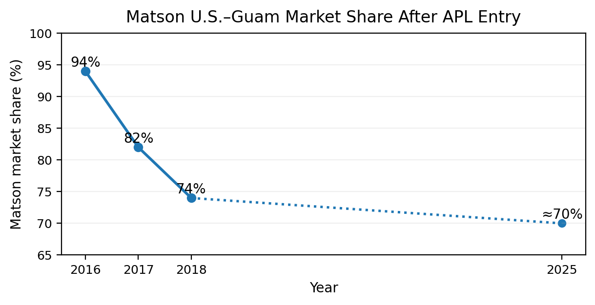
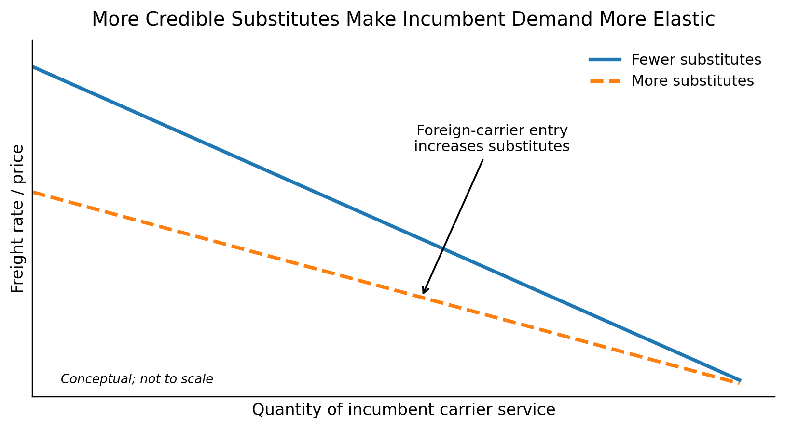

**Sailing Past the Cargo: Would Foreign Ships Carrying Domestic Cargo Lower Hawaiʻi’s Westbound Freight Rate?**

Eric Carmichael

BUS 620 — Individual Research Paper

Shidler College of Business, University of Hawaiʻi at Mānoa

10.09.2026

**Would Foreign Ships Carrying Domestic Cargo Lower Hawaiʻi’s Westbound Freight Rate?**

Almost everything sold in Hawai’i depends on ocean freight. HDOT estimates that 85% of goods consumed in the state are imported and that 91% of those goods arrive through commercial ports (Hawaiʻi Department of Transportation \[HDOT\], 2024). The West Coast – Hawai’i route is dominated by a duopoly made up of Matson and Pasha. The Jones Act limits domestic cargo between U.S. ports to U.S.-built, U.S. flagged, U.S owned vessels with predominately U.S. crews (46 U.S.C. § 55102). I will test a narrow counterfactual: let a foreign-flagged container ship already serving Honolulu carry domestic containers between Honolulu and a West Cost port, waiving vessel-eligibility rules for that one route only.

This question is a current issue ep. Ed Case introduced H.R. 667 in January 2025 to open noncontiguous trade more broadly to qualifying foreign-flag vessels; it remains introduced/referred (U.S. Congress, 2025). I expect that exemption would create downward pricing pressure primarily for the westbound trade. The decision hinges on whether the current restrictions exclude plausible competitors, whether past market entries have changed behavior and whether route economics explain current prices.

**The Jones Act Restricts the Potential Competitive Set**

Ocean transport has substantial fixed costs and economies of scale, which means removing a single legal barrier would not create perfect competition. Instead, a viable market entrant would still need sustainable volume, port access, containers, crews and a competitive sailing schedule. Matson identifies Pasha as its primary U.S.-flagged competitor in Hawai’i and foreign carriers like Ocean Network Express (ONE) and CMA CGM as competitors for international cargo (Matson, Inc 2026). The counterfactual simply makes those foreign carriers eligible for domestic cargo without first building a U.S. coastwise fleet.

CMA CGM’s 2025 Eagle Express X rotation called Los Angeles, Oakland, then Honolulu and Dutch Harbor, with Honolulu every two weeks (CMA CGM, 2025). Los Angeles illustrates the broader transpacific imbalance. In 2025 it handled 5.32 million loaded import TEUs[^1], 1.43 million loaded export TEUs, and about 3.49 million empty containers (Port of Los Angeles, 2025). A westbound carrier could monetize otherwise empty capacity. Matson’s five weekly West Coast departures[^2] remain a major service advantage.

**Competition Has Changed Pricing Behavior Previously**

Matson’s response to Pasha provides a solid example of competition influencing freight pricing. The factual record in American President Lines, LLC v. Matson, Inc. (2025, pp. 46–49) describes a house-hold goods loyalty program debuted by Matson in 2016 to customers shipping household goods designed to compete with Pasha. Here, “household goods” means military and commercial/personal relocation shipments, not groceries or general retail cargo. Matson offered a 15% discount at a 90% Hawaiʻi volume threshold with later tiers reaching 20%, or 25% when the threshold was met in both Hawaiʻi and Guam. Those discounts show an incumbent cutting realized prices to retain volume, although loyalty programs can raise switching costs. More substitutes make residual demand more elastic and constrain markups (Stauffer, 2026).

Guam provides a useful example as it is exempted from the U.S. build requirement but must still be served by U.S. flagged vessels. American President Lines (APL) entered the U.S – Guam trade with U.S.-flagged, foreign-built ships at end of 2015. After entry, Matson’s market share fell from around 94% in 2016 to 82% in 2017 and 74% in 2018; 2025 court records show showed the figure at 70% (Figure 1; American President Lines, LLC v. Matson, Inc., 2025, pp. 14–17). Post APL entry, Home Depot initially allocated only 10% of its Guam volume to APL even though APL was about 40% cheaper because transit was roughly seven days longer (p. 55). Matson’s former Vice President of Pricing also described Pacific Northwest-to-Guam price adjustments in response to APL’s Oakland-to-Guam pricing (p. 12). Guam supports the competition mechanism, not foreign-flag entry probability. Figure 2 illustrates that mechanism.

**Directional Pricing Limits How Much Competition Can Do**

Matson’s household goods rates show a large directional discrepancy for Hawai’i. In 2025, the base rate for a 40ft container was \$7,276 westbound and \$4,254 eastbound. In 2026, the same rates were \$7,476 and \$4,354 respectively (Matson Navigation Company, 2025, 2026). The westbound rate was 71% higher in both years. Both directions operate under the same coastwise laws and carrier market, so the gap cannot be identified as a Jones Act premium.

HDOT data shows Hawaiʻi bringing in far more domestic tonnage than it sends out, consistent with unused eastbound backhaul capacity (HDOT, 2019). With strong westbound loads, more fixed round-trip cost must be recovered inbound; eastbound space that would otherwise sail empty can be priced closer to marginal cost. That can create a large directional spread even without strong market power. Competition could compress westbound markups but cannot erase the load imbalance. If entrants skim lower-urgency westbound cargo, incumbents could shift some cost eastbound or reduce frequency. GAO did not itself find stable rates: four carriers said rates had generally remained stable, and seven of nine interviewed entities said carrier numbers were adequate; GAO said the interviews were not generalizable (U.S. Government Accountability Office \[GAO\], 2022).

**The Strongest In-Scope Objection Is That Foreign Carriers May Not Enter**

The strongest objection is that removing the legal restriction may not create new entrants. Foreign carriers still face added transit time, service-frequency disadvantages, switching costs and the basic economics of serving Hawaiʻi. The Guam evidence shows that lower prices may not win much volume. But this counterfactual has a lower hurdle than a greenfield entrant: CMA CGM already called Honolulu on an international rotation, while the westbound imbalance creates an incremental-revenue opportunity. Matson’s 2025 Form 10-K says a Jones Act repeal, amendment, or waiver enabling lower-cost foreign-built or foreign-flagged entry in Hawaiʻi would adversely affect its business (Matson, Inc., 2026). A credible entry threat can discipline prices before an entrant wins much share (Stauffer, 2026). That does not prove entry, but it makes the hypothesis plausible. If no carrier participates, the freight-rate effect is negligible.

National security remains a real cost of policy. The Jones Act is also defended on merchant-marine and military-sealift grounds (GAO, 2022) but valuing U.S.-flag capacity in a crisis is outside this paper’s freight-rate question and must be separately studied.

**Decision Rule and Recommendation**

On freight-rate grounds, I would recommend against an exemption if a credible entrant showed neither meaningful customer volume nor a measurable incumbent pricing response, or if foreign carriers had no economic reason to compete for domestic Hawaiʻi cargo after becoming eligible. Pasha in Hawaiʻi and APL in Guam satisfy the second test: competition changed incumbent behavior. This does not prove a definitive foreign entrant, but CMA CGM’s Honolulu call, the westbound imbalance, and Matson’s disclosed Jones Act risk give a carrier reason to test the market. If none enters, there is no rate-based reason to continue or expand the exemption.

I therefore support a narrow Honolulu–West Coast container exemption rather than H.R. 667’s broader opening. Track entry, switching, rates, sailing frequency, and any eastbound response. Pressure should be greatest on less time-sensitive westbound cargo. The evidence supports lower-rate potential however, the size of any saving is uncertain.

**Figures**

**Figure 1. Matson U.S.–Guam market share after APL entry.**

Note. Following APL entry, Matson’s share was approximately 94% in 2016, 82% in 2017, and 74% in 2018. The 2025 federal court opinion described Matson as then handling roughly 70% of U.S.–Guam shipping volume. The dotted segment connects nonannual observations and should not be read as a trend. Guam is comparator evidence for the competition mechanism, not a causal estimate for Hawaiʻi. Source: American President Lines, LLC v. Matson, Inc. (2025, pp. 14–17).

**Figure 2. More credible substitutes make incumbent demand more elastic.**

Note. Conceptual illustration. Allowing additional carriers to compete increases the number of credible substitutes available to shippers. The residual demand facing an incumbent therefore becomes more elastic, reducing pricing power. The figure shows the expected direction of the mechanism, not the magnitude of any Hawaiʻi rate reduction. Source: Author illustration based on the BUS 620 pricing-power framework.

**References**

American President Lines, LLC v. Matson, Inc., No. 1:21-cv-02040 (D.D.C. 2025). https://law.justia.com/cases/federal/district-courts/district-of-columbia/dcdce/1:2021cv02040/233910/195/

CMA CGM. (2025). EXX - Eagle Express X. https://www.cma-cgm.com/assets/public/documents/EXX_CMA%20CGM_20251126.pdf

Hawaiʻi Department of Transportation. (2019). Hawaiʻi Statewide Freight Plan. https://hidot.hawaii.gov/highways/files/2019/03/HDOT_FreightPlan_FINAL.pdf

Hawaiʻi Department of Transportation. (2024). Hawaiʻi Statewide Freight Plan. https://hidot.hawaii.gov/highways/files/2024/04/HDOT-Freight-Plan-Final-Report-2024-03-01.pdf

Matson, Inc. (2026). Annual report on Form 10-K for the year ended December 31, 2025. U.S. Securities and Exchange Commission. https://www.sec.gov/Archives/edgar/data/3453/000110465926020944/matx-20251231x10k.htm

Matson Navigation Company. (2025). Hawaiʻi household goods tariff, effective June 1, 2025. https://www.matson.com/others/Hawaii_Service_June_1_2025.pdf

Matson Navigation Company. (2026). Hawaiʻi household goods tariff, effective June 1, 2026. https://www.matson.com/others/HHG_Hawaii_6.26.pdf

Port of Los Angeles. (2025). 2025 Port of Los Angeles container statistics. https://portoflosangeles.org/business/statistics/container-statistics/historical-teu-statistics-2025

Stauffer, A. W. (2026). BUS 620 Session 4: Power \[Course slides\]. Shidler College of Business, University of Hawaiʻi at Mānoa.

U.S. Congress. (2025). Noncontiguous Shipping Relief Act of 2024 (H.R. 667, 119th Cong.). U.S. Government Publishing Office. https://www.govinfo.gov/app/details/BILLS-119hr667ih

U.S. Government Accountability Office. (2022). Domestic oceangoing shipping: Information on the Surface Transportation Board’s regulatory processes (GAO-22-105391). https://www.gao.gov/products/gao-22-105391

United States Code, 46 U.S.C. § 55102, Transportation of merchandise. https://uscode.house.gov/view.xhtml?req=granuleid:USC-prelim-title46-section55102&num=0&edition=prelim

[^1]: TEU = twenty-foot equivalent unit.

[^2]: Two each from Long Beach and Oakland, and one from Tacoma.
