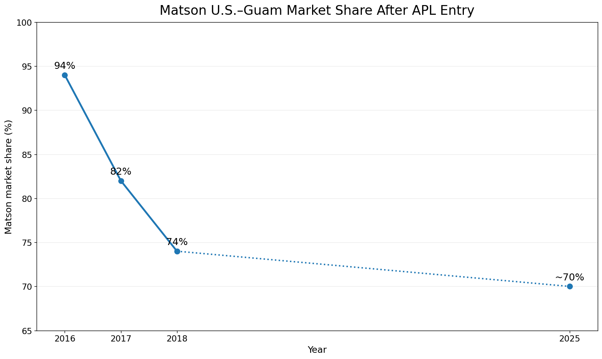

**Sailing Past the Cargo: Would Foreign Ships Carrying Domestic Cargo Lower Hawaiʻi’s Westbound Freight Rate?**

Eric Carmichael

BUS 620 — Individual Research Paper

Shidler College of Business, University of Hawaiʻi at Mānoa

10.09.2026

**Would Foreign Ships Carrying Domestic Cargo Lower Hawaiʻi’s Westbound Freight Rate?**

Almost everything sold in the state of Hawai’i depends in some ways on ocean freight for the goods that it consumes. The Hawai’i Department of Transportation estimates that 85% of all goods in the state are imported and that 91% of those goods arrive through commercial ports (Hawaiʻi Department of Transportation \[HDOT\], 2024). 96% of West Coast to Hawai’i cargo capacity is served by the oligopoly made up of Matson and Pasha. The remainder is served by smaller barge operators. Federal cabotage law prohibits foreign-flagged vessels from transporting domestic goods between two U.S ports. There are currently foreign operators that transport cargo directly to Hawai’i from international ports in Asia, however, they are unable to load domestic cargo on the West Coast bound for Hawai’i or load Hawaiian cargo bound for the mainland (46 U.S.C. § 55102). At least one foreign carrier already operates a route that includes both Los Angeles and Honolulu on the same rotation, however, the Jones act disallows them from carrying any domestic cargo between already serviced ports.

For a legislator to decide whether to support a narrow Honolulu-West Coast container exemption, the most useful question would be whether or not passing an exemption to the Jones Act for vessels sailing this route would increase the competition beyond the oligopoly of Matson and Pasha. My expectation is that an exemption would create downward pricing pressure in both directions, with a far greater opportunity to reduce costs on the west-bound leg of the journey. The evidence cannot support precise %age or dollar reductions as there are too many variables, so the decision hinges on whether the current restrictions exclude plausible competitors, whether or not similar exemptions and subsequent market entries have changed behavior and whether there are alternative explanations for the current prices.

**The Current Jones Act Restrictions Limits the Potential Competitive Set**

Ocean transport has substantial fixed costs and economies of scale, which means removing a single legal barrier to entry would not create perfect competition. Instead, a viable market entrant would still need sustainable volume, port access, containers, crews and a schedule that is competitive in attracting new customers. Matson identifies Pasha as its primary U.S competitor in Hawai’i and foreign carriers like Ocean Network Express and CMA CGM as competitors for international cargo (Matson, Inc 2026). The coastwise exemption is relevant here as it completely limits the foreign carriers from even considering domestic Honolulu – West Coast cargo as part of their route-network.

While removing the legal barrier would not guarantee that either of these carriers would enter, it would open the door. Matson’s own 2025 form 10-K identifies changes to the Jones Act as a competitive risk that could allow lower-cost carriers to enter the Hawai’i market which reinforces the economic plausibility that the restriction does prevent an increase in competition. On the other hand, Matson’s and Pasha’s current network, sailing frequency, service or other factors may continue to be more attractive to domestic shippers.

**Competition Has Changed Pricing Behavior Previously**

Matsons response to Pasha provides a solid example of competition influencing freight pricing in Hawai’i. The factual record in *American President Lines, LLC v Matson Inc.* (2025) describes a loyalty program debuted by Matson in 2016 to customers shipping household goods designed to specifically compete with Pasha. Customers who shipped at least 90 % of their household goods through Matsons were granted a 15% discount. Later revisions of the program increased the discount up to 25% depending on qualifying shipments to Hawaii and Guam. These were economically meaningful price reductions directly tied to retaining customer volume in a market where Pasha was an alternative carrier. When customers have a credible substitute, the incumbents have an incentive to compete on price.

Guam provides a second example of the mechanism. After American President Lines entered into the U.S – Guam trade at the tail-end of 2015, Matson’s market share fell from around 94% in 2016 to 82% in 2017 and 74% in 2018, a 20 percentage point decline. The 2025 court record places it at roughly 70% (Figure 1). The same record describes a detailed example on Home Depot’s Guam volume. APL was about 40% cheaper but roughly seven days slower that Matson. Due to this, Home Depot only shifted 10% of it’s Guam volume to APL. This means that while the pricing did allow APL to capture meaningful share, the service quality was a constraint that prevented a larger shift. This shows that a credible entrant to the market can durably erode the incumbent’s share and create price competition. Paired with Matson’s Hawai’i cargo discount program this supports the mechanism.

**Westbound Pricing Discrepancy is Counterevidence, Not Necessarily a Jones Act Premium**

Matson’s household goods rates show a large directional discrepancy between route directions. In 2025, the base ocean rate for a 40ft container was \$7,276 from the West Coast to Honolulu and \$4,254 from Honolulu to the West Coast. In 2026, the same rates were \$7,476 and \$4,354 respectively. The westbound rate was 71% higher in both years (Figure 2). Because both directions operate under the same coastwise law and the same basic carrier market, this difference cannot identify a Jones Act premium on its own.

Instead, this gap is evidence of a cargo imbalance, capacity underutilization, marginal cost differences and demand variability. Hawai’i imports much more merchandise than it exports, meaning vessels must often return to the Mainland without every cargo slot filled. Once the vessel and voyage are committed, the marginal cost of filling otherwise unused backhaul capacity can be well below the average voyage cost. This directional gap materially weakens the competition argument in that a new entrant could pressure the tariff rates but the structural westbound/eastbound differences would remain.

**Decision Rule and Recommendation**

I would recommend against an exemption to the Jones Act if evidence supported the idea that a credible entrant showed neither meaningful customer shipping nor a measurable incumbent pricing response, or if carriers in already operating throughout the Pacific had no economic reason to compete for domestic Hawai’i cargo after becoming legally eligible. In that situation, changing the eligibility would have no impact on the freight rates. The available evidence that I presented does not meet those failure criteria. Pasha competition directly resulted in material discounting by Matson in Hawai’i while American President Lines’ entry in the Guam market coincided with a substantial reduction in Matson’s market share and created documented pricing competition.

A local legislator therefore has reasonable economic grounds to back a narrow Honolulu – Westcoast shipping exemption. The recommendation should remain modest. The available evidence does not support a concrete rate reduction prediction but does support a directional conclusion. The law as it stands, restricts the competitive set and prior Pacific-market evidence shows that credible entrants can change customer behavior and market pricing. At the same time, the directional pricing gap illustrates the structural nature of the market. The most defensible conclusion is that removing the legal barrier to entry would likely create downward competitive pressure, especially on the Westbound route, while the magnitude of potential savings remains uncertain.

**Figures**

**Figure 1. Matson U.S.–Guam market share after APL entry.**

Note. Matson’s U.S.–Guam market share fell from approximately 94% in 2016 to 82% in 2017 and 74% in 2018 after APL entered the trade. A 2025 federal court opinion describes Matson as currently handling roughly 70% of U.S.–Guam shipping volume. The dotted segment indicates that annual observations between 2018 and the latest public figure are not plotted. Guam is comparator evidence for the competition mechanism, not a causal estimate for Hawaiʻi.

**Figure 2. More credible substitutes make incumbent demand more elastic.**

Note. Conceptual illustration. Allowing additional carriers to compete increases the number of credible substitutes available to shippers. The residual demand facing an incumbent therefore becomes more elastic, reducing pricing power. The figure shows the expected direction of the mechanism, not the magnitude of any Hawaiʻi rate reduction. Source: Author illustration based on the BUS 620 pricing-power framework

**References**

American President Lines, LLC v. Matson, Inc., No. 1:21-cv-02040 (D.D.C. 2025). https://law.justia.com/cases/federal/district-courts/district-of-columbia/dcdce/1:2021cv02040/233910/195/

Hawaiʻi Department of Transportation. (2024). Hawaiʻi Statewide Freight Plan. https://hidot.hawaii.gov/highways/files/2024/04/HDOT-Freight-Plan-Final-Report-2024-03-01.pdf

Matson, Inc. (2026). Annual report on Form 10-K for the year ended December 31, 2025. U.S. Securities and Exchange Commission. https://www.sec.gov/Archives/edgar/data/3453/000110465926020944/matx-20251231x10k.htm

Matson Navigation Company. (2025). Hawaiʻi household goods tariff, effective June 1, 2025. https://www.matson.com/others/Hawaii_Service_June_1_2025.pdf

Matson Navigation Company. (2026). Hawaiʻi household goods tariff, effective June 1, 2026. https://www.matson.com/others/HHG_Hawaii_6.26.pdf

United States Code, 46 U.S.C. § 55102, Transportation of merchandise. https://uscode.house.gov/view.xhtml?req=granuleid:USC-prelim-title46-section55102&num=0&edition=prelim
