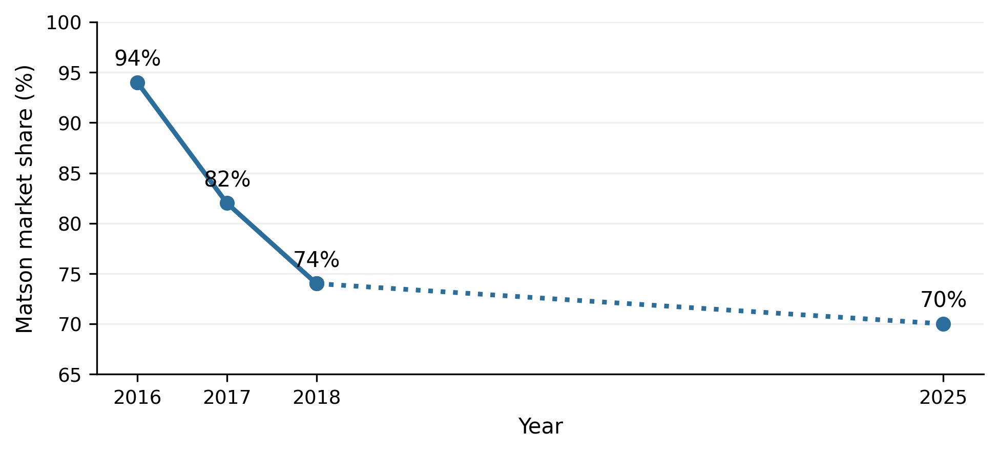
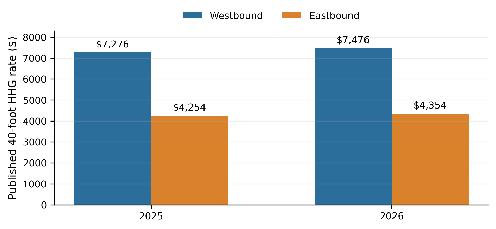
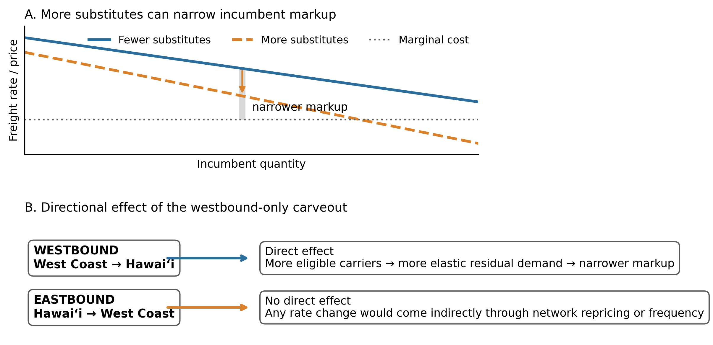

**Sailing Past the Cargo: Would Foreign Ships Carrying Domestic Cargo Lower Hawaiʻi’s Westbound Freight Rate?**

Eric Carmichael

BUS 620 — Individual Research Paper

Shidler College of Business, University of Hawaiʻi at Mānoa

10.09.2026  
**Would Foreign Ships Carrying Domestic Cargo Lower Hawaiʻi’s Westbound Freight Rate?**

Almost everything sold in the State of Hawaiʻi depends on ocean freight. The Hawaiʻi Department of Transportation (HDOT, 2024) estimates that 85% of goods consumed in the state are imported and 91% of those imports arrive through commercial ports. Much of this volume is transported by Matson and Pasha who together form a duopoly in the West Coast–Hawaiʻi trade. Federal coastwise law reserves domestic merchandise moves for U.S.-owned, coastwise-qualified vessels (Maritime Administration \[MARAD\], 2026). I test a narrower counterfactual: letting a foreign-flag container ship already serving Honolulu carry domestic containers from a West Coast port to Honolulu, waiving vessel eligibility only for that westbound move.

The question is current. Rep. Ed Case introduced H.R. 667 in January 2025 to open noncontiguous trade more broadly to qualifying foreign-flag vessels, but it has not advanced to a House vote (Noncontiguous Shipping Relief Act of 2024, 2025). Lower rates would first reduce shippers’ landed costs. Consumers would gain only if savings pass through to shelf prices. Incumbent carriers and U.S.-flag maritime labor could lose if volume shifted. The decision hinges on market entry, competitive response, and route economics.

**The Jones Act Restricts the Potential Competitive Set**

Ocean transport has substantial fixed costs and economies of scale, which means removing a single legal barrier would not create perfect competition. Instead, a viable market entrant still needs sustainable volume, port access, containers, crews, and a competitive sailing schedule. Matson identifies Pasha as its primary U.S.-flagged competitor in Hawai’i and foreign carriers Ocean Network Express and CMA CGM as competitors for international cargo (Matson, Inc., 2026). The counterfactual simply makes those foreign carriers eligible for domestic cargo without first acquiring a U.S. coastwise-qualified fleet.

CMA CGM’s 2025 Eagle Express X rotation called at Los Angeles, Oakland, then Honolulu and Dutch Harbor, with Honolulu every two weeks (CMA CGM, 2025). In 2025, Los Angeles handled 5.32 million loaded import twenty-foot equivalent units (TEUs), 1.43 million loaded export TEUs, and about 3.49 million empty TEUs (Port of Los Angeles, 2025). That imbalance suggests westbound capacity that could earn incremental Hawaiʻi revenue.

**Competition Has Changed Pricing Behavior Previously**

Matson’s pricing responses show competition can matter. A 2016 household-goods loyalty program aimed at Pasha offered a 15% discount at a 90% Hawaiʻi-volume threshold. After APL entered Guam, Matson expanded the program in 2018 to 20% at a 90% threshold in either Hawaiʻi or Guam and 25% when customers met it in both markets (*American President Lines, LLC v. Matson, Inc.*, 2025, pp. 45–46). The original discount responded to Pasha; the larger cross-trade tiers followed APL’s Guam entry. The discounts show an incumbent using price to defend volume, although loyalty terms can raise switching costs.

Guam provides another example but is not a direct foreign-flagged comparison. American President Lines (APL) entered the U.S – Guam trade with U.S.-flagged, foreign-built ships at end of 2015. After entry, Matson’s market share fell from around 94% in 2016 to 82% in 2017 and 74% in 2018; 2025 court records showed the figure at 70% (Figure 1; American President Lines, LLC v. Matson, Inc., 2025, pp. 14–17). Post APL entry, Home Depot initially allocated only 10% of its Guam volume to APL even though APL was about 40% cheaper because transit was roughly seven days longer (*American President Lines, LLC v. Matson, Inc.*, 2025, p. 55). Matson’s former vice president of pricing said Matson sometimes adjusted Pacific Northwest prices in response to APL’s Oakland rates (*American President Lines, LLC v. Matson, Inc.*, 2025, p. 12). Guam supports the competitive-response mechanism, not foreign-entry probability.

**Directional Pricing Limits How Much Competition Can Do**

Matson’s household goods rates show a large directional discrepancy for Hawai’i (Figure 2). In 2025, the base rate for a 40ft container was \$7,276 westbound and \$4,254 eastbound. In 2026, the same rates were \$7,476 and \$4,354 respectively (Matson Navigation Company, 2025, 2026). The westbound rate was ~71% higher in both years. Both directions operate under the same coastwise laws and carrier market, so the gap cannot be identified as a Jones Act premium.

Hawaiʻi’s ocean cargo flows are strongly inbound: from 2001 through 2016, the state averaged 12.8 million tons inbound and 1.7 million tons outbound annually (Hawaiʻi Department of Business, Economic Development & Tourism \[DBEDT\], 2019). That imbalance supports cheap eastbound backhaul and greater recovery of round-trip cost westbound. More competitors could narrow westbound markups without erasing that structural gap. Indirect responses could include schedule or network-price changes (Figure 3). GAO reported that four carriers described noncontiguous rates as generally stable and seven of nine interviewed entities considered carrier numbers adequate, while cautioning that the interviews were not generalizable (U.S. Government Accountability Office \[GAO\], 2022).

**The Strongest In-Scope Objection Is That Foreign Carriers May Not Enter**

Foreign carriers must still consider transit time, service frequency, and switching costs. Matson’s five weekly West Coast departures – two each from Long Beach and Oakland and one from Tacoma – give it a significant service-frequency advantage over CMA CGM’s fortnightly Honolulu service (CMA CGM, 2025; Matson, Inc., 2026).

The Guam evidence shows that lower-priced service may not win much volume when it is slower. CMA CGM already calls Honolulu and westbound cargo offers incremental-revenue potential, but the business case remains unproven. Matson’s Form 10-K lists Jones Act repeal, amendment, or waiver as a competitive risk if lower-cost foreign-built or foreign-flag vessels enter Hawaiʻi (Matson, Inc., 2026). That shows the incumbent recognizes the competitive risk, not that a foreign carrier intends to enter. Without participation, there is no new competitive constraint and no rate benefit.

A separate policy consideration is the national-security capacity potentially put at risk. The Jones Act is defended partly on the grounds that it supports merchant-marine, mariner, shipyard, and military-sealift capacity (Frittelli, 2019; GAO, 2022), which this freight-rate analysis does not attempt to value.

**Decision Rule and Recommendation**

On freight-rate grounds, I would reject the exemption if no eligible foreign carrier shows credible interest or if entry wins no meaningful volume and produces no incumbent price or service response. Pasha in Hawaiʻi and APL in Guam show why the second condition matters: competition won volume and changed incumbent behavior. This does not, however, prove that a foreign carrier would enter the Hawaiʻi market, but CMA CGM’s Honolulu call, the westbound imbalance, and Matson’s disclosed Jones Act risks make a market test plausible. If no carrier enters, or if entry produces neither meaningful switching nor a measurable incumbent response, there is no freight-rate case for continuing the exemption.

I therefore support a narrow Honolulu–West Coast container exemption rather than H.R. 667’s broader opening. For two years, HDOT should monitor entry, switching, westbound rates, sailing frequency, and indirect eastbound effects. Pressure should be greatest on less time-sensitive westbound cargo, particularly among shippers willing to trade some transit time for a lower rate. The evidence supports the potential for lower rates; however, the size of any savings is uncertain.

**Figures**

**Figure 1**

*Matson U.S.–Guam Market Share After APL Entry*

*Note.* Following APL’s entry, Matson’s share was approximately 94% in 2016, 82% in 2017, and 74% in 2018. The court reported that it then fluctuated around 70% until after the COVID-19 pandemic. The dotted segment spans a gap in reported years and should not be read as an annual trend. Guam is comparator evidence for the competition mechanism, not a causal estimate for Hawaiʻi. Data from *American President Lines, LLC v. Matson, Inc.* (2025, pp. 14–17).

**Figure 2**

*Published Hawaiʻi Household-Goods Rates by Direction*

*Note.* Published rates for a 40-foot household-goods container. Westbound rates were approximately 71% above eastbound in 2025 and 72% above eastbound in 2026. Military household-goods moves remain subject to U.S.-flag cargo preference, so these rates are used only to illustrate directionality. Data from Matson Navigation Company (2025, 2026).

**Figure 3**

*How Additional Competition Could Affect Directional Pricing*

*Note.* Conceptual illustration, not to scale. More credible substitutes make an incumbent’s residual demand more elastic and can narrow the markup over marginal cost. The proposed carveout directly changes westbound eligibility only; eastbound rates receive no direct treatment and could move only through indirect network responses. Author illustration based on the BUS 620 pricing-power framework (Stauffer, 2026).

**References**

American President Lines, LLC v. Matson, Inc. No. 1:21-cv-02040 (D.D.C. Mar. 19, 2025). https://law.justia.com/cases/federal/district-courts/district-of-columbia/dcdce/1:2021cv02040/233910/195/

CMA CGM. (2025). *EXX – Eagle Express X*. https://www.cma-cgm.com/assets/public/documents/EXX_CMA%20CGM_20251126.pdf

Frittelli, J. (2019). *Shipping under the Jones Act: Legislative and regulatory background* (CRS Report R45725). Congressional Research Service. https://www.congress.gov/crs_external_products/R/PDF/R45725/R45725.4.pdf

Hawaiʻi Department of Business, Economic Development & Tourism. (2019). *Marine cargo and waterborne commerce in Hawaii’s economy: Trends and patterns in Hawaii marine cargo 2001–2016*. https://files.hawaii.gov/dbedt/economic/reports/Marine_Cargo_Study_Final.pdf

Hawaiʻi Department of Transportation. (2024). *2023 Hawaiʻi statewide freight plan*. https://hidot.hawaii.gov/highways/files/2024/04/HDOT-Freight-Plan-Final-Report-2024-03-01.pdf

Maritime Administration. (2026). *Domestic shipping*. U.S. Department of Transportation. https://www.maritime.dot.gov/ports/domestic-shipping/domestic-shipping

Maritime Administration. (n.d.). *Frequently asked questions (FAQs) – Cargo preference*. Retrieved October 6, 2026, from https://www.maritime.dot.gov/ports/cargo-preference/frequently-asked-questions-faqs-cargo-preference

Matson, Inc. (2026). *Annual report on Form 10-K for the year ended December 31, 2025*. U.S. Securities and Exchange Commission. https://www.sec.gov/Archives/edgar/data/3453/000110465926020944/matx-20251231x10k.htm

Matson Navigation Company. (2025). *Hawaiʻi household goods tariff, effective June 1, 2025*. https://www.matson.com/others/Hawaii_Service_June_1_2025.pdf

Matson Navigation Company. (2026). *Hawaiʻi household goods tariff, effective June 1, 2026*. https://www.matson.com/others/HHG_Hawaii_6.26.pdf

Noncontiguous Shipping Relief Act of 2024, H.R. 667, 119th Cong. (2025). https://www.govinfo.gov/app/details/BILLS-119hr667ih

Port of Los Angeles. (2025). *2025 Port of Los Angeles container statistics*. Retrieved October 6, 2026, from https://portoflosangeles.org/business/statistics/container-statistics/historical-teu-statistics-2025

Stauffer, A. W. (2026). *BUS 620 Session 4: Power* \[PowerPoint slides\]. Shidler College of Business, University of Hawaiʻi at Mānoa.

U.S. Government Accountability Office. (2022). *Domestic oceangoing shipping: Information on the Surface Transportation Board’s regulatory processes* (GAO-22-105391). https://www.gao.gov/products/gao-22-105391
