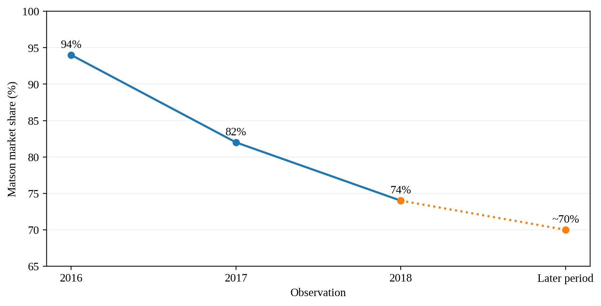
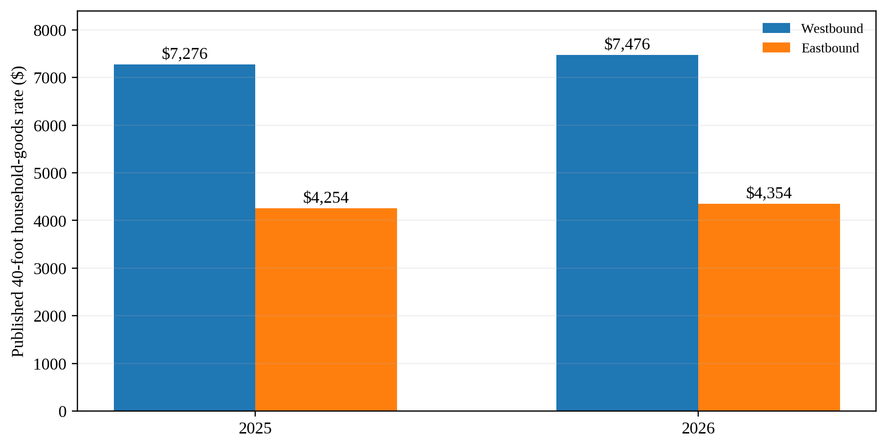
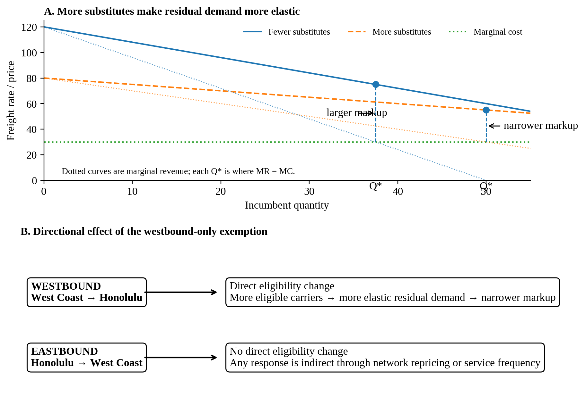

**Sailing Past the Cargo: Would Foreign Ships Carrying Domestic Cargo Lower Hawaiʻi’s Westbound Freight Rate?**

Eric Carmichael

BUS 620 — Individual Research Paper

Shidler College of Business, University of Hawaiʻi at Mānoa

10.09.2026  
**Sailing Past the Cargo: Would Foreign Ships Carrying Domestic Cargo Lower Hawaiʻi’s Westbound Freight Rate?**

Almost everything sold in Hawaiʻi depends on ocean freight. The Hawaiʻi Department of Transportation (HDOT, 2024) estimates that 85% of goods consumed in the state are imported and 91% of those imports arrive through commercial ports. Matson and Pasha together form the duopoly in West Coast–Hawaiʻi container service (Matson, Inc., 2026). Federal coastwise law reserves domestic merchandise moves for U.S.-owned, coastwise-qualified vessels (Maritime Administration, 2026). I test a limited counterfactual: allow foreign-flag container ships already serving Honolulu to carry domestic containers westbound from West Coast ports to Honolulu, while leaving eastbound eligibility unchanged.

Rep. Ed Case introduced H.R. 667 in January 2025 to open noncontiguous trade more broadly to qualifying foreign-flag vessels. It was referred to the Coast Guard and Maritime Transportation Subcommittee on January 24, 2025, but has not advanced to a House vote (U.S. Congress, 2025). Lower rates would first reduce shippers’ landed costs; consumers benefit only if savings pass through to shelf prices. Incumbent carriers and U.S.-flag maritime labor could lose if volume shifts. The decision hinges on market entry, competitive response, and route economics.

**The Jones Act Restricts the Potential Competitive Set**

Ocean transport has large fixed costs and economies of scale, so legal eligibility alone would not create perfect competition. A viable entrant still needs sustainable volume, port access, containers, crews, and a competitive sailing schedule. Matson identifies Pasha as its primary U.S.-flag competitor in Hawaiʻi and Ocean Network Express and CMA CGM as competitors for international cargo (Matson, Inc., 2026). CMA CGM’s Eagle Express X calls Los Angeles, Oakland, Honolulu, and Dutch Harbor, with Honolulu service every two weeks (CMA CGM, 2025). In 2025, Los Angeles handled 5.32 million loaded import twenty-foot equivalent units (TEUs), 1.43 million loaded export TEUs, and about 3.49 million empty TEUs (Port of Los Angeles, 2025). That imbalance suggests westbound capacity that could earn incremental Hawaiʻi revenue.

**Competition Has Changed Pricing Behavior**

Matson’s pricing responses show competition can matter. A 2016 household-goods loyalty program aimed at Pasha offered a 15% discount at a 90% Hawaiʻi-volume threshold. After American President Lines (APL) entered Guam, Matson expanded the program in 2018 to 20% at a 90% threshold in either Hawaiʻi or Guam and 25% when customers met it in both markets (*American President Lines, LLC v. Matson, Inc.*, 2025, pp. 45–46). Here, household goods are relocation shipments, not grocery or retail cargo. The discounts show an incumbent using price to defend volume, although loyalty terms can raise switching costs. Economically, more credible substitutes make an incumbent’s residual demand more elastic; at the profit-maximizing point, that narrows the markup over marginal cost (Figure 3, Panel A; Stauffer, 2026).

Guam is an illustrative comparator but not a direct foreign-flag example. APL entered the U.S.–Guam trade with U.S.-flag, foreign-built ships at the end of 2015. Matson’s market share fell from about 94% in 2016 to 82% in 2017 and 74% in 2018, then fluctuated around 70% until after the COVID-19 pandemic (Figure 1; *American President Lines, LLC v. Matson, Inc.*, 2025, pp. 14–17). Home Depot initially allocated only 10% of its Guam volume to APL despite rates about 40% lower because APL’s transit was roughly seven days longer (p. 55). Matson’s former vice president of pricing also testified that Matson sometimes adjusted Pacific Northwest prices in response to APL’s Oakland rates (p. 12). Guam thus shows volume switching and incumbent price response, while service differences can limit switching.

**Directional Pricing Limits How Much Competition Can Do**

Matson’s household-goods rates show a large directional gap for Hawaiʻi (Figure 2). In 2025, the base rate for a 40-foot container was \$7,276 westbound and \$4,254 eastbound; in 2026, the rates were \$7,476 and \$4,354, respectively (Matson Navigation Company, 2025, 2026). Westbound was about 71% higher in 2025 and 72% higher in 2026. Both directions operate under the same coastwise laws and carrier market, so the gap cannot be identified as a Jones Act premium.

Domestic marine cargo averaged about 4.6 million tons inbound and 1.0 million tons outbound annually from 2001 through 2016 (Hawaiʻi Department of Business, Economic Development & Tourism, 2019). That imbalance supports cheaper eastbound backhaul and greater recovery of round-trip cost westbound. More competitors could narrow westbound markups without erasing that structural gap. The U.S. Government Accountability Office (GAO, 2022) reported that four carriers described rates as generally stable and seven of nine participants considered carrier numbers adequate; this tempers the case for a large effect, though the interviews were not generalizable.

**The Strongest In-Scope Objection Is That Foreign Carriers May Not Enter**

Foreign carriers must still consider transit time, service frequency, and switching costs. Matson’s five weekly West Coast departures yield three Honolulu arrivals per week, versus CMA CGM’s one call every two weeks (CMA CGM, 2025; Matson, Inc., 2026). Guam also shows lower-priced service may win little volume when slower. CMA CGM already calls Honolulu, so westbound cargo offers incremental revenue, but the business case remains unproven.

Matson’s Form 10-K lists Jones Act repeal, amendment, or waiver as a competitive risk if lower-cost foreign-built or foreign-flag vessels enter Hawaiʻi (Matson, Inc., 2026). That disclosure does not show entrant intent, but it does show that the incumbent treats foreign entry as a competitive threat. In contestable-market terms, a credible entry threat can constrain incumbent pricing before a new carrier wins substantial share (Stauffer, 2026).

A separate policy cost is national-security capacity. The Jones Act is defended partly for merchant-marine, mariner, shipyard, and military-sealift capacity (Frittelli, 2019; GAO, 2022). This analysis does not estimate those benefits.

**Decision Rule and Recommendation**

On freight-rate grounds, I would reject or not renew the exemption if no eligible foreign carrier shows credible interest and there is neither meaningful switching nor an incumbent price or service response. Pasha in Hawaiʻi demonstrates an incumbent response; APL in Guam demonstrates both switching and response. Those comparators do not prove foreign entry, but CMA CGM’s Honolulu call, the westbound imbalance, and Matson’s risk disclosure make a time-limited market test plausible.

I therefore support a two-year, westbound-only West Coast-to-Honolulu container exemption rather than H.R. 667’s broader opening. Congress should require participating carriers to report service, volume, and realized rates to the Maritime Administration; HDOT can track local service and frequency. Renew only if the pilot produces credible entry, switching, or a measurable incumbent response. Lower-rate effects should be most likely for shippers willing to accept slower service. The evidence supports potential, not a precise savings estimate.

**Figures**

**Figure 1**

*Matson U.S.–Guam Market Share After APL Entry*

*Note.* Following American President Lines’ (APL) entry, Matson’s share was approximately 94% in 2016, 82% in 2017, and 74% in 2018. The court reported that it then fluctuated around 70% until after the COVID-19 pandemic; the final marker is therefore labeled as a later period rather than 2025. Guam is comparator evidence for the competition mechanism, not a causal estimate for Hawaiʻi. Data from *American President Lines, LLC v. Matson, Inc.* (2025, pp. 14–17).

**Figure 2**

*Published Hawaiʻi Household-Goods Rates by Direction*

*Note.* Published rates for a 40-foot household-goods container. Westbound rates were approximately 71% above eastbound in 2025 and 72% above eastbound in 2026. Military household-goods moves remain subject to U.S.-flag cargo preference (Maritime Administration, n.d.). These published rates are used only to illustrate directionality, not the full traffic eligible under the exemption. Data from Matson Navigation Company (2025, 2026).

**Figure 3**

*How Additional Competition Could Affect Directional Pricing*

*Note.* Conceptual illustration, not to scale. More credible substitutes make an incumbent’s residual demand more elastic and can narrow the markup over marginal cost at the profit-maximizing quantity. The proposed exemption directly changes westbound eligibility only; eastbound rates receive no direct treatment and could move only through indirect network responses. Author illustration based on the BUS 620 pricing-power framework (Stauffer, 2026).

**References**

*American President Lines, LLC v. Matson, Inc.*, No. 1:21-cv-02040 (D.D.C. Mar. 19, 2025). https://law.justia.com/cases/federal/district-courts/district-of-columbia/dcdce/1:2021cv02040/233910/195/

CMA CGM. (2025). *EXX – Eagle Express X*. https://www.cma-cgm.com/assets/public/documents/EXX_CMA%20CGM_20251126.pdf

Frittelli, J. (2019). *Shipping under the Jones Act: Legislative and regulatory background* (CRS Report No. R45725). Congressional Research Service. https://www.congress.gov/crs_external_products/R/PDF/R45725/R45725.4.pdf

Hawaiʻi Department of Business, Economic Development & Tourism. (2019). *Marine cargo and waterborne commerce in Hawaii’s economy: Trends and patterns in Hawaii marine cargo 2001–2016*. https://files.hawaii.gov/dbedt/economic/reports/Marine_Cargo_Study_Final.pdf

Hawaiʻi Department of Transportation. (2024). *2023 Hawaiʻi statewide freight plan*. https://hidot.hawaii.gov/highways/files/2024/04/HDOT-Freight-Plan-Final-Report-2024-03-01.pdf

Maritime Administration. (n.d.). *Frequently asked questions (FAQs) – Cargo preference*. U.S. Department of Transportation. Retrieved October 6, 2026, from https://www.maritime.dot.gov/ports/cargo-preference/frequently-asked-questions-faqs-cargo-preference

Maritime Administration. (2026). *Domestic shipping*. U.S. Department of Transportation. https://www.maritime.dot.gov/ports/domestic-shipping/domestic-shipping

Matson, Inc. (2026). *Annual report on Form 10-K for the year ended December 31, 2025*. U.S. Securities and Exchange Commission. https://www.sec.gov/Archives/edgar/data/3453/000110465926020944/matx-20251231x10k.htm

Matson Navigation Company. (2025). *Hawaiʻi household goods tariff, effective June 1, 2025*. https://www.matson.com/others/Hawaii_Service_June_1_2025.pdf

Matson Navigation Company. (2026). *Hawaiʻi household goods tariff, effective June 1, 2026*. https://www.matson.com/others/HHG_Hawaii_6.26.pdf

Port of Los Angeles. (2025). *2025 Port of Los Angeles container statistics*. Retrieved October 6, 2026, from https://portoflosangeles.org/business/statistics/container-statistics/historical-teu-statistics-2025

Stauffer, A. W. (2026). *BUS 620 Session 4: Power* \[PowerPoint slides\]. Shidler College of Business, University of Hawaiʻi at Mānoa.

U.S. Congress. (2025). *H.R. 667—Noncontiguous Shipping Relief Act of 2024: Actions*. Congress.gov. https://www.congress.gov/bill/119th-congress/house-bill/667/all-actions

U.S. Government Accountability Office. (2022). *Domestic oceangoing shipping: Information on the Surface Transportation Board’s regulatory processes* (GAO-22-105391). https://www.gao.gov/products/gao-22-105391
