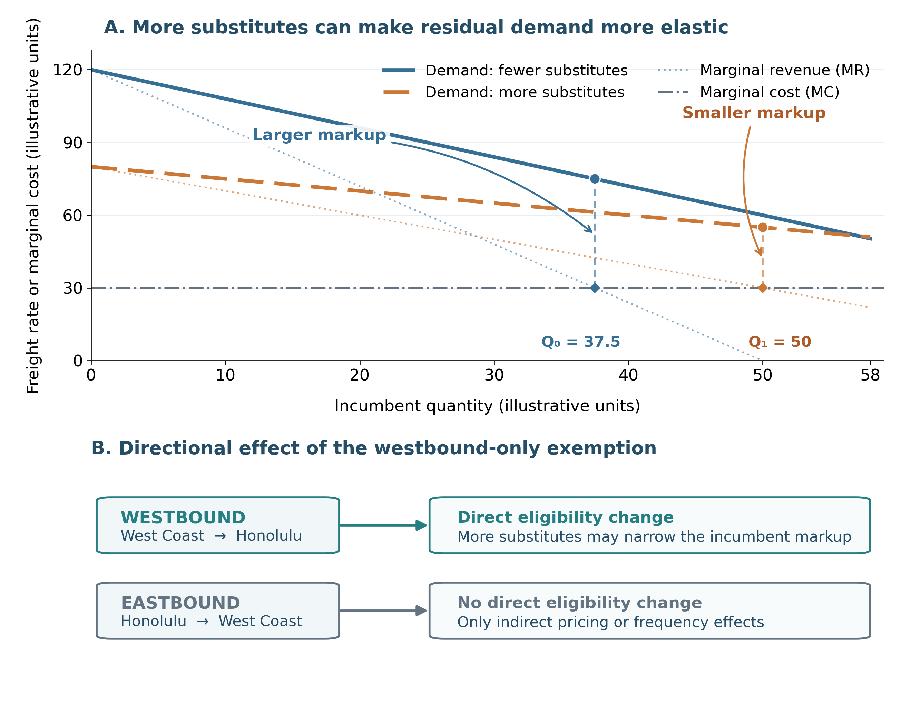
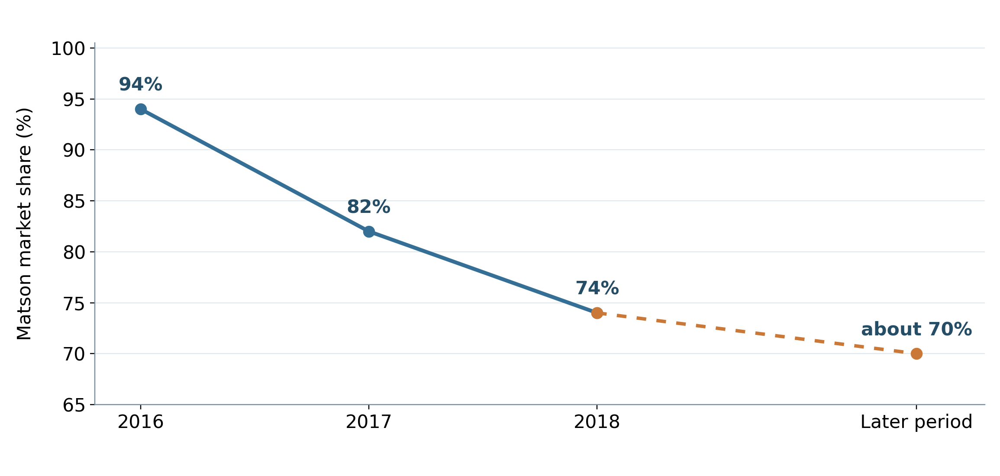
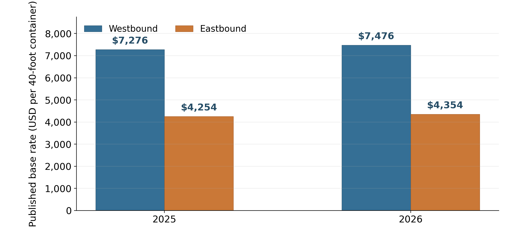

**Sailing Past the Cargo: Would Foreign Ships Carrying Domestic Cargo Lower Hawaiʻi’s Westbound Freight Rate?**

Eric Carmichael

Shidler College of Business, University of Hawaiʻi at Mānoa

BUS 620: Micro- and Macro-Economic Foundations for Managers

Individual Research Paper

Adam W. Stauffer

October 9, 2026

**Sailing Past the Cargo: Would Foreign Ships Carrying Domestic Cargo Lower Hawaiʻi’s Westbound Freight Rate?**

Almost everything sold in Hawaiʻi depends on ocean freight. The Hawaiʻi Department of Transportation (HDOT, 2024) estimates that 85% of goods consumed in the state are imported and 91% of those imports arrive through commercial ports. Matson and Pasha make up the duopoly in domestic West Coast–Hawaiʻi container service (Matson, Inc., 2026). Federal coastwise law reserves domestic merchandise moves for U.S.-owned, coastwise-qualified vessels (Maritime Administration, 2026). I test a limited counterfactual: providing an exemption to foreign-flag ships already serving Honolulu to carry domestic containers westbound from West Coast ports, leaving eastbound eligibility unchanged.

Rep. Ed Case introduced H.R. 667 in January 2025 to open noncontiguous trade more broadly to qualifying foreign-flag vessels. It was referred to the Coast Guard and Maritime Transportation Subcommittee on January 24, 2025, but has not advanced to a House vote (U.S. Congress, 2025). Lower rates would first reduce shippers’ landed costs; consumers benefit only if savings pass through to shelf prices. Incumbent carriers and U.S.-flag maritime labor could lose if volume shifts. The decision to authorize an exemption hinges on market entry, competitive response, and route economics.

**The Jones Act Restricts the Potential Competitive Set**

Ocean transport has large fixed costs and economies of scale, so legal eligibility alone would not create perfect competition. A viable entrant still needs sustainable volume, port access, containers, crews, and a competitive sailing schedule. Matson identifies Pasha as its primary U.S.-flag competitor in Hawaiʻi, and Ocean Network Express and CMA CGM as competitors for international cargo (Matson, Inc., 2026). CMA CGM’s Eagle Express X calls at Los Angeles, Oakland, Honolulu, and Dutch Harbor, visiting Honolulu every two weeks (CMA CGM, 2025). In 2025, Los Angeles handled 5.32 million loaded import twenty-foot equivalent units (TEUs) but only 1.43 million loaded export TEUs; it also shipped 3.49 million empty TEUs outbound, illustrating the substantial container repositioning created by the imbalance between inbound and outbound cargo (Port of Los Angeles, 2025). That imbalance suggests potential westbound capacity, not proof of unused slots on CMA CGM’s Honolulu leg.

**Competition Has Changed Pricing Behavior**

Matson’s pricing response shows competition can matter. In 2016, a household-goods (relocation) loyalty program aimed at Pasha offered a 15% discount at a 90% Hawaiʻi-volume threshold. After American President Lines (APL) entered Guam, Matson expanded the program in 2018 to 20% at a 90% threshold in either market and 25% when met in both markets (*American President Lines, LLC v. Matson, Inc.*, 2025, p. 46). The voluntary program had no term, though losing discounts could modestly raise switching costs. More credible substitutes make an incumbent’s residual demand more elastic, narrowing its profit-maximizing markup over marginal cost (Figure 1, Panel A; Stauffer, 2026).

Guam is a comparator, not a foreign-flag example. Foreign-owned APL entered the U.S.–Guam trade in 2015 with U.S.-flag ships (*American President Lines, LLC v. Matson, Inc.*, 2025, pp. 3–4). Matson’s share fell from 94% in 2016 to 82% in 2017 and 74% in 2018, later fluctuating around 70% (Figure 2; *American President Lines, LLC v. Matson, Inc.*, 2025, p. 15). Home Depot planned to award APL only 10% of its Guam volume despite rates about 40% lower, citing both APL’s new service and lead time roughly seven days longer than Matson’s Hawaiʻi–Guam service (*American President Lines, LLC v. Matson, Inc.*, 2025, pp. 28, 55). Matson’s former pricing vice president also described adjusting Seattle–Tacoma-to-Guam prices in response to APL’s Oakland-to-Guam rates (*American President Lines, LLC v. Matson, Inc.*, 2025, p. 13). Guam shows volume shifts and price responses, while service differences can limit switching.

**Directional Pricing Limits How Much Competition Can Do**

Matson’s published household-goods base rates show a directional gap for a 40-foot container (Figure 3): \$7,276 westbound versus \$4,254 eastbound in 2025, and \$7,476 versus \$4,354 in 2026 (Matson Navigation Company, 2025, 2026). The westbound rate was about 71% higher in 2025 and 72% higher in 2026. Both directions face the same coastwise rules, so the gap cannot be identified as a Jones Act premium.

Domestic marine cargo averaged about 4.6 million tons inbound and 1.0 million tons outbound annually during 2001–2016 (Hawaiʻi Department of Business, Economic Development & Tourism, 2019). That imbalance supports cheaper eastbound backhaul and greater recovery of round-trip cost westbound. Entry could narrow westbound markups without erasing the structural gap. The U.S. Government Accountability Office (GAO, 2022) reported that four carriers described rates as generally stable and seven of nine interviewed entities considered carrier numbers adequate. Those limited interviews temper expectations of a large effect and are not generalizable.

**The Strongest In-Scope Objection Is That Foreign Carriers May Not Enter**

Foreign carriers must still consider transit-time, frequency, and switching-cost disadvantages. Matson’s five West Coast departures yield three Honolulu arrivals weekly, versus CMA CGM’s one call every two weeks (CMA CGM, 2025; Matson, Inc., 2026). Guam confirms that lower prices do not necessarily overcome slower service. However, were CMA CGM to add domestic cargo to an existing Honolulu call, its fixed investment would be less than launching an entirely new route. Without a temporary exemption to the Jones Act, available slots and demand will remain unproven.

Matson’s Form 10-K lists Jones Act repeal, amendment, or waiver as a risk if lower-cost foreign-built or foreign-flag ships enter Hawaiʻi (Matson, Inc., 2026). That disclosure is not evidence of an entrant’s intent. However, it does show an incumbent considering foreign entry a threat, and a credible entry threat may constrain pricing before significant volumes move (Stauffer, 2026).

A separate policy cost is a possible loss of national-security shipping capacity. The Jones Act is defended partly for merchant-marine, mariner, shipyard, and military-sealift capabilities (Frittelli, 2019; GAO, 2022). This analysis does not estimate those benefits.

**Decision Rule and Recommendation**

On freight-rate grounds, the Pasha and APL comparisons justify testing the mechanism, not assuming foreign entry. Pasha drew a pricing response in Hawaiʻi; APL gained volume and drew repricing in Guam. A westbound-only exemption targets international carriers’ existing Honolulu calls and Hawaiʻi’s fuller inbound leg. No comparable foreign return service is shown, and eastbound backhaul already has spare capacity.

I would have Congress enact a two-year West Coast-to-Honolulu container exemption, narrower than H.R. 667. Congress should require confidential reports to the Maritime Administration of realized westbound contract rates, loaded TEUs, and frequency, with HDOT tracking local service. Congress should renew the exemption only if carriers submit bona fide bids or carry domestic westbound boxes and either shippers switch volume or incumbents’ fuel- and mix-adjusted realized rates fall relative to the 12 months before the exemption, without a material service decline. The evidence supports possible rate reductions, not a savings estimate.

**References**

American President Lines, LLC v. Matson, Inc*.*, No. 1:21-cv-02040 (D.D.C. Mar. 19, 2025). https://law.justia.com/cases/federal/district-courts/district-of-columbia/dcdce/1:2021cv02040/233910/195/

CMA CGM. (2025). *EXX: Eagle Express X*. https://www.cmacgm.com/assets/public/documents/EXX_CMA%20CGM_20251126.pdf

Frittelli, J. (2019). *Shipping under the Jones Act: Legislative and regulatory background* (CRS Report No. R45725). Congressional Research Service. https://www.congress.gov/crs_external_products/R/PDF/R45725/R45725.4.pdf

Hawaiʻi Department of Business, Economic Development & Tourism. (2019). *Marine cargo and waterborne commerce in Hawaii’s economy: Trends and patterns in Hawaii marine cargo 2001–2016*. https://files.hawaii.gov/dbedt/economic/reports/Marine_Cargo_Study_Final.pdf

Hawaiʻi Department of Transportation. (2024). *2023 Hawaiʻi statewide freight plan*. https://hidot.hawaii.gov/highways/files/2024/04/HDOT-Freight-Plan-Final-Report-2024-03-01.pdf

Maritime Administration. (n.d.). *Frequently asked questions (FAQs): Cargo preference*. U.S. Department of Transportation. Retrieved October 6, 2026, from https://www.maritime.dot.gov/ports/cargo-preference/frequently-asked-questions-faqs-cargo-preference

Maritime Administration. (2026). *Domestic shipping*. U.S. Department of Transportation. https://www.maritime.dot.gov/ports/domestic-shipping/domestic-shipping

Matson, Inc. (2026). *Annual report on Form 10-K for the year ended December 31, 2025*. U.S. Securities and Exchange Commission. https://www.sec.gov/Archives/edgar/data/3453/000110465926020944/  
matx-20251231x10k.htm

Matson Navigation Company. (2025). \[Published Hawaiʻi household-goods tariff, effective June 1, 2025\]. https://www.matson.com/others/Hawaii_Service_June_1_2025.pdf

Matson Navigation Company. (2026). \[Published Hawaiʻi household-goods tariff, effective June 1, 2026\]. https://www.matson.com/others/HHG_Hawaii_6.26.pdf

OpenAI. (2026). *ChatGPT* (GPT-5.6 Sol) \[Large language model\]. https://chatgpt.com/

Port of Los Angeles. (2025). *2025 Port of Los Angeles container statistics*. Retrieved October 6, 2026, from https://portoflosangeles.org/business/statistics/container-statistics/historical-teu-statistics-2025

Stauffer, A. W. (2026). *BUS 620 session 4: Power* \[PowerPoint slides\]. Shidler College of Business, University of Hawaiʻi at Mānoa.

U.S. Congress. (2025). *H.R. 667—Noncontiguous Shipping Relief Act of 2024: Actions*. Congress.gov. https://www.congress.gov/bill/119th-congress/house-bill/667/all-actions

U.S. Government Accountability Office. (2022). *Domestic oceangoing shipping: Information on the Surface Transportation Board’s regulatory processes* (GAO-22-105391). https://www.gao.gov/products/gao-22-105391

**Figure 1**

*How Additional Competition Could Affect Directional Pricing*

*Note.* Conceptual curves in Panel A illustrate separate profit-maximizing quantities where marginal revenue equals marginal cost; values are not observed Hawaiʻi freight rates. Panel B applies the westbound-only exemption; eastbound effects would be indirect. Figure generated with ChatGPT (OpenAI, 2026) in Python from the author’s analytical specification and the BUS 620 pricing-power framework (Stauffer, 2026).

**Figure 2**

*Matson U.S.–Guam Market Share After APL Entry*

*Note.* American President Lines (APL) entered in 2015. Matson’s share was about 94% in 2016, 82% in 2017, and 74% in 2018, later fluctuating around 70% until after the COVID-19 pandemic; the last marker is a later-period summary, not a 2025 observation. Guam is a comparator, not an estimate for Hawaiʻi. Chart generated with ChatGPT (OpenAI, 2026) in Python from author-selected data in *American President Lines, LLC v. Matson, Inc.* (2025, p. 15).

**Figure 3**

*Published Hawaiʻi Household-Goods Rates by Direction*

*Note.* Published base rates for a 40-foot household-goods container; westbound rates exceeded eastbound by about 71% in 2025 and 72% in 2026. Military household-goods shipments remain subject to U.S.-flag cargo preference (Maritime Administration, n.d.), so these rates illustrate directionality but are not representative prices for all cargo eligible under the exemption. Chart generated with ChatGPT (OpenAI, 2026) in Python from Matson Navigation Company (2025, 2026) tariff data.
